Welcome To SANDARCs VE Manual!

This manual should clarify all of SANDARC's policies when it comes to exams and help you in your journey to providing the best possible experience to the applicant's and to the amazing volunteers that make this hobby better.

The current leadership within SANDARC is listed bellow.

* President: Austin Smith - W4PBL
* Vice President - Open
* Treasurer: Martin Latterich - AF5T
* Secretary: J Goldberg - AF6GM
* VEC Manager: Greg Smith - N6NYX
* Technical Director: Sepehr Sahraian - N6IRN
* Director: Mike Oberbauer - KG6TDP

### SANDARC Mission & Values

- Free exams for all applicants — no fees, no exceptions.
- Professional, welcoming sessions that make every applicant feel comfortable, regardless of background or experience level.
- Strict exam integrity — SANDARC maintains high standards to ensure that every license earned is a license deserved.
- Service to the San Diego Amateur Radio community and beyond.

### Program Structure

| Role                    | Function                                                                                                                                                   |
|-------------------------|------------------------------------------------------------------------------------------------------------------------------------------------------------|
| FCC                     | Regulates the Amateur Radio Service; grants licenses; retains oversight of the VEC/VE system.                                                              |
| SANDARC VEC             | Coordinates VE efforts; screens session paperwork; forwards data to the FCC electronically; retains records per FCC requirements. Contact: vec@sandarc.org |
| VE Team (minimum 3 VEs) | Administers exams to candidates at in-person or remote sessions.                                                                                           |
| Candidates / Applicants | Take written examinations for new or upgraded licenses.                                                                                                    |

### License Classes & Exam Elements

| License Class | Elements Required                            | Passing Score         |
|---------------|----------------------------------------------|-----------------------|
| Technician    | Element 2 — 35 questions                     | 26 correct (74%)      |
| General       | Elements 2 & 3 — 35 questions each           | 26 correct each (74%) |
| Amateur Extra | Elements 2, 3 & 4 — Element 4 = 50 questions | 37 correct (74%)      |

## Session Submission Process

